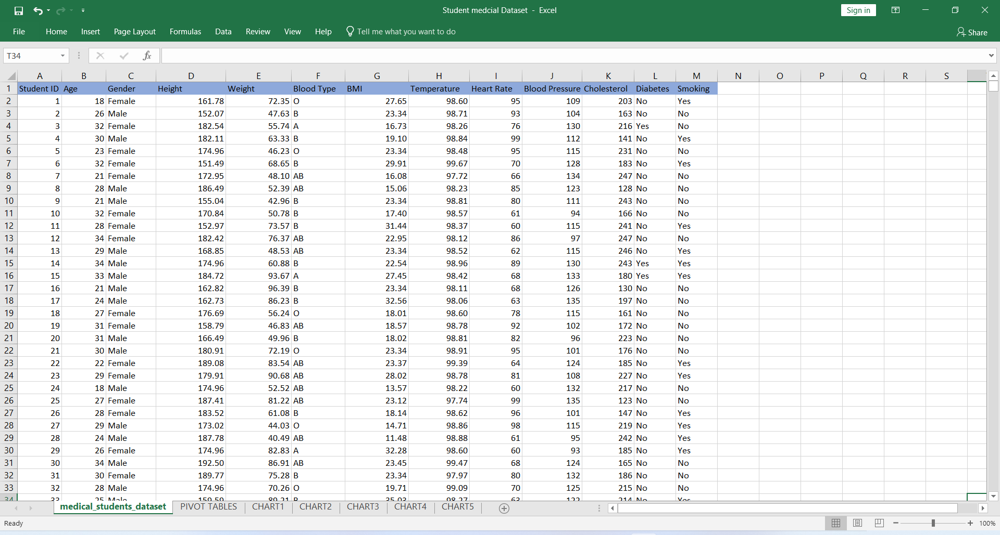
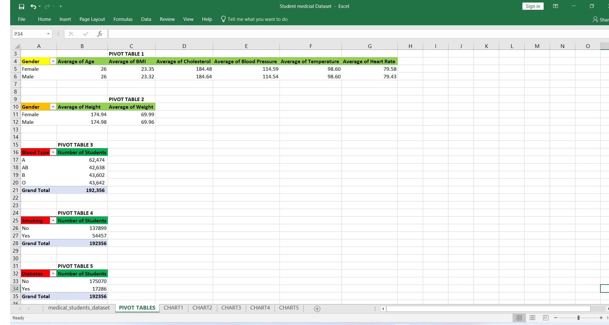
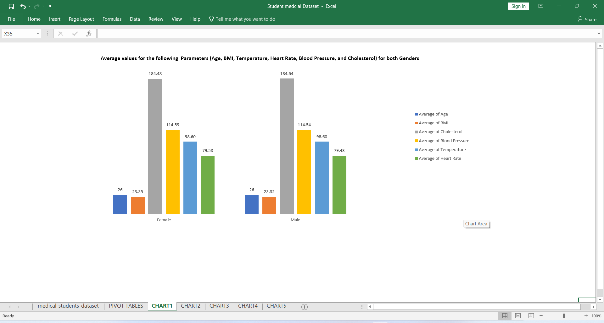
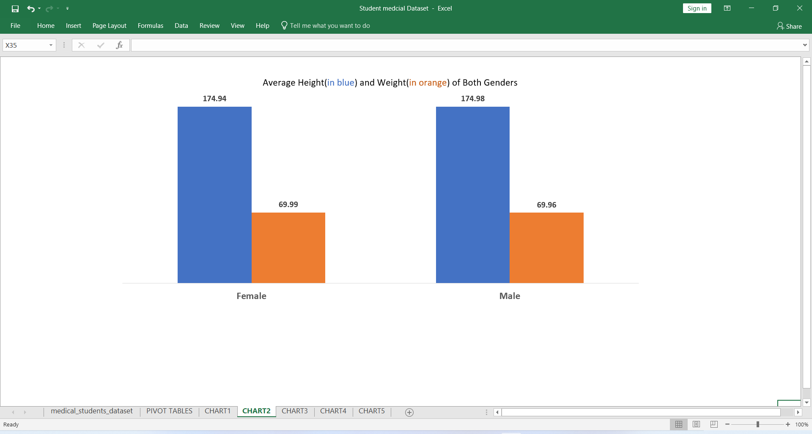
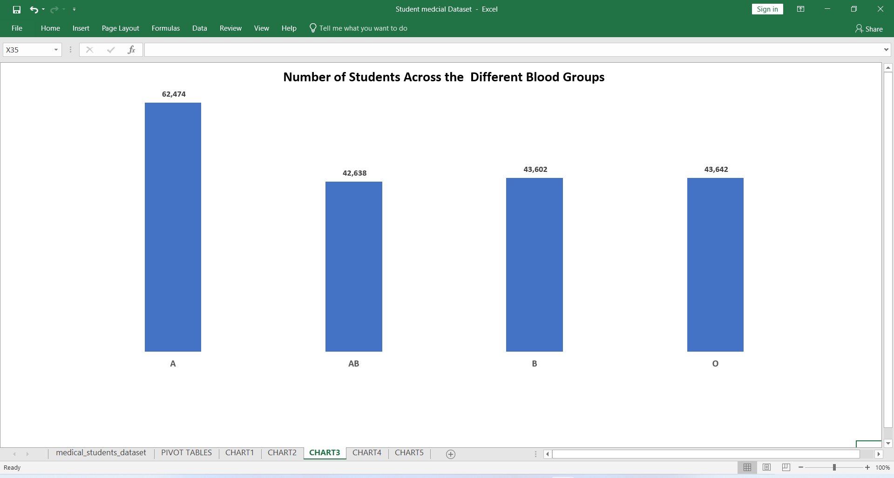
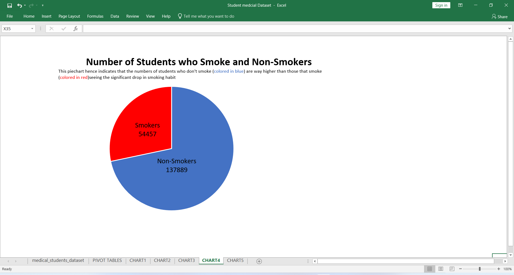
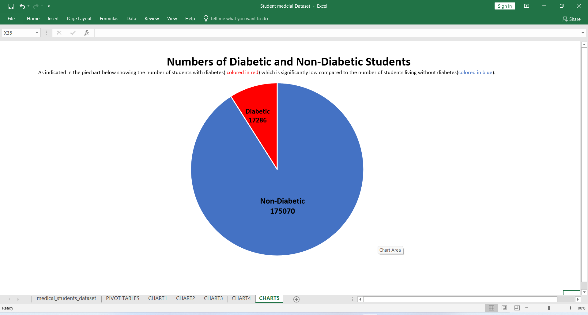

## INTRODUCTION
As we delve deeper into the use of Excel in data analysis which involves the use of PIVOT TABLES and DATA VISUALIZATION which are powerful tools for summarizing,
analysing and manipulating large datasets quickly and easily...Also the graphical representation of data to present complex information in a clear and visually appealing manner,
we analysed a dataset cointaning student medical parameters using the above metioned tools but before we go any futher in showing the use of these tools,
we need to understand the key features of these tools
#### PIVOT TABLES
- Data summarization: Performing various calculations like sum, average, count, max, min, etc.
- Dynamic layout: Data flexibly, allowing for easy rearrangement and quick changes in the report layout.
- Filters and sorting: filtering and sorting data, to allow focus on specific subsets of information.
- Grouping and categorization: Grouping data by date, number ranges, or custom categories for better organization.
- Calculated fields and items
#### DATA VISUALIZATION
- Breaking down complex data
- Identifies insights
- Enables decision-making
- Effective and resourceful communication

Now let's head on to using these powerful tools with thier amazing features to analyse a large dataset cointaing about 192,357 Students with their various parameters like
(Student ID,	Age	Gender,Height,Weight,Blood Type,BMI,Temperature,Heart Rate,Blood Pressure,Cholesterol,Diabetes and Smoking)..Phew!! That's quite a lot yeah,PIVOT TABLES AND 
DATA VISUALIZATION TO THE RESCUE

### TASK 1
Below is the image of the Student Medcial Dataset we would be working on,deciding,deducing,summarizing ,manipulating and finally visualizing in graphs the tasks also detailed below

Using the Medical Students Data, create Pivot Tables displaying the following:
- Average values for the following for Male and Females (Age, BMI, Temperature, Heart Rate, Blood Pressure, and Cholesterol)
- Average Height and Weight for both Genders (in 2 decimal places)
- Number of students across the different Blood Groups
- Number of Students who smoke and those who don’t
- Number of Students who have diabetes and those who don’t

### SOLUTION USING PIVOT TABLES
The image below shows all of the necessary pivot tables detailing answers to all of the above questions raised

### TASK 2
Visualize the insights gotten from the Pivot Tables created in the previous TASK using the Student Medical Dataset...
which simply means all of the representation on the image containing our pivot tables would be visualized via charts

### SOLUTION USING DATA VISUALIZATION

##### CHART 1

As the title of the chart implies,showing the Average values for both Genders(Male and Female),Thier Age,BMI,Temperature,Heart Rate,Blood Pressure, and Cholesterol Level..
this was visualized using a 2-D Column Chart and it can thus be deduced that the average values for all of the parameters represented are just slightly different for both genders

##### CHART 2

Using a 2-D Column Chart still,the Average  Height(colored in blue) and Weight(colored in orange) in 2 decimal places are visualized and as noticed both values between both genders are just slightly different

##### CHART 3

Seeing the versality of the 2-D Column Chart,the number of students across the different blood groups are visualized,and we can deduce from this,that there are
more students with the blood group A and the rest of the numbers are shared just slightly different across the rest of the blood groups AB, B and O

##### CHART 4

Now we are seeing a different kind of chart known as the 2-D Pie Chart,visualizing the number of students who are smokers and non-smokers,from the figures visualized,
it's safe to say there's a significant drop in the numbers of smokers and a larger number of non-smokers

##### CHART 5

2-D Pie Charts are easily my favorite kinda chart cos they are just round and simply..visualizing the number of students who are diabetic and those who ain't
we can deduce that a larger propotion of students are free from diabetes...

### CONCLUSION
For a dataset containing about 192,358 rows which is quite the set,you can see how we have represented and broken in smaller bits the large dataset using powerful tools like
PIVOT TABLES AND DATA VISUALIZATION...values calculated,data manipulated and summarized, visualization and story telling at it's finest
